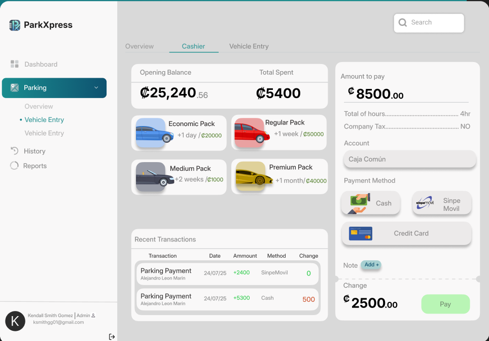
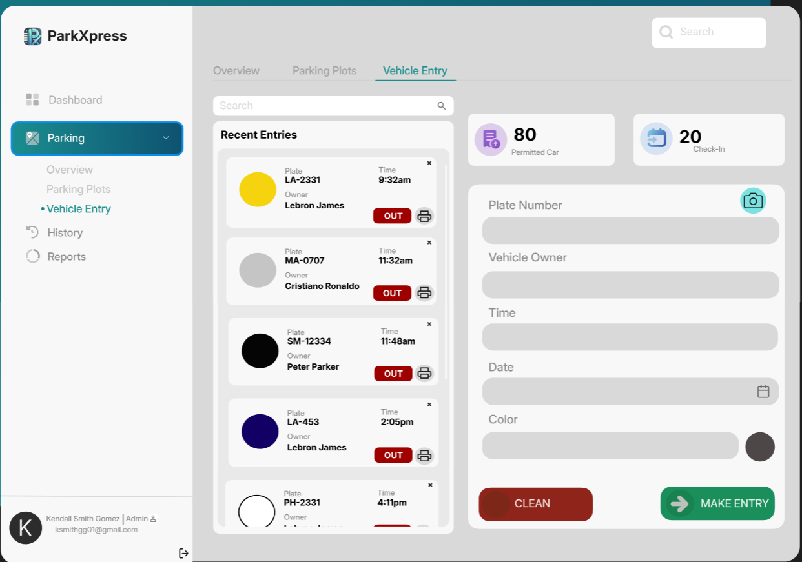
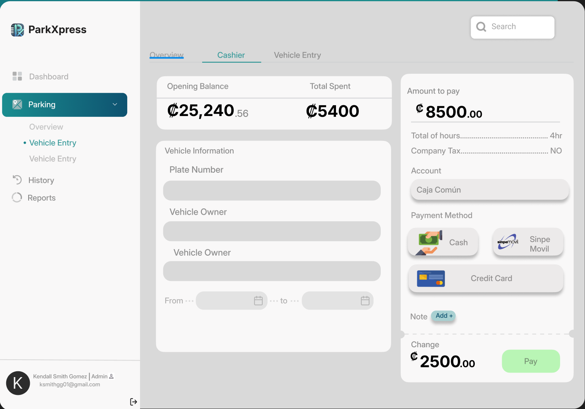

# 🚗 E-Parking

_E-Parking_ es un sistema web moderno e inteligente de gestión de parqueos que automatiza el control de acceso de vehículos, el cobro de tarifas y la generación de reportes, utilizando tecnologías de punta e inteligencia artificial para reconocimiento de placas.

## 🖼️ Vista General del Sistema

## 🎯 Objetivo General

Diseñar e implementar un sistema web que optimice la gestión de parqueo, permitiendo la automatización del control de acceso de vehículos, el cálculo de costos de estacionamiento y la generación de reportes administrativos.

## ✅ Funcionalidades Principales

- 📥 **Registro y control de entradas/salidas** con cámara y reconocimiento de placas.
- 🧾 **Facturación automática** con cálculo de cobros en tiempo real, y manejo de cajas.
- 📊 **Reportes detallados** de uso, ingresos y tiempo promedio de estadía.
- 👥 **Gestión de usuarios** y permisos administrativos.
- 🧠 **Detección automática de color y placa del vehículo** desde la cámara del celular.

## 🛠️ Tecnologías Utilizadas

### Frontend

  
  
  
  
  
  
  

### Backend

  
  
  
  
  
  

### Dev Tools

  
  
  
  
  

## 📈 Módulo de Reportes

- Total de ingresos generados.
- Número de vehículos registrados.
- Historial de entradas y salidas con filtros por fecha.

## 💳 Módulo de Caja

- Configuración de paquetes de cobro (económico, regular, premium).
- Diferentes métodos de pago: efectivo, Sinpe Móvil, tarjeta.
- Generación e impresión del ticket de salida.

## 🎞️Imágenes Generales
  

  
  
  

  

## 📍 Información de Área

Cada zona de parqueo contiene:
- Nombre del área y tipo (normal, preferencial, etc.).
- Ubicación.
- Responsable a cargo.

## 💡 Beneficios del Sistema

- Reducción del tiempo de espera.
- Automatización completa del proceso de acceso y salida.
- Eliminación de errores humanos en cobros.
- Mejora en la toma de decisiones con reportes actualizados.
- Escalabilidad y fácil integración con nuevos módulos.

---

Desarrollado por **Alejandro León Marín** y **Kendall Fonseca Hidalgo**  
📅 Proyecto Final - Programación IV  
🗓️ Febrero 2025
